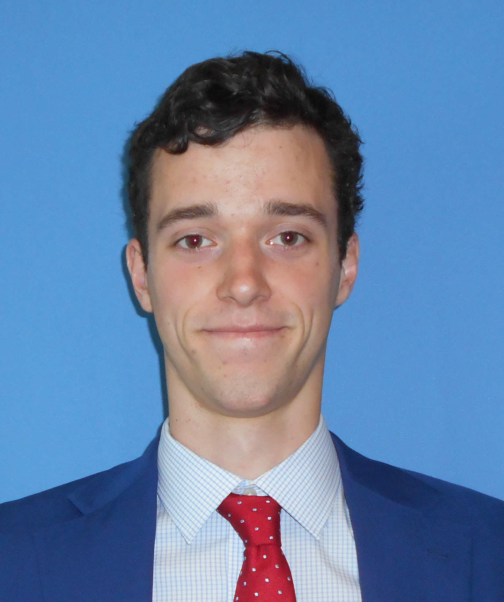

## About Me

I'm Alistair - a Data Scientist and Software Engineer. Currently working as a Strategist at Goldman Sachs within the Investment Banking Division. I studied [Astrophysics](https://www.ast.cam.ac.uk/students) at University of Cambridge from 2013-2016.

In my spare time time I enjoy running (half-marathons and [parkrun](https://www.parkrun.org.uk/)), cycling and rock climbing.

I am a significant contributor to the open source data science python stack, mainly [Pandas](https://github.com/pandas-dev/pandas).

# Useful Development Resources

### Pandas/Dataframes

1. [Pandas user guide](https://pandas.pydata.org/pandas-docs/stable/user_guide/index.html)
2. [Modern Pandas](https://tomaugspurger.github.io/modern-8-scaling.html)
3. [Interactive Grid](https://github.com/quantopian/qgrid)

## ML/Data Science

1. [Feature Tools](https://docs.featuretools.com)

### AI

1. [Open AI Gym](https://gym.openai.com/)

## Useful Meetup Presentations
1. [London Pytorch Meetup](London Pytorch Meetup)
